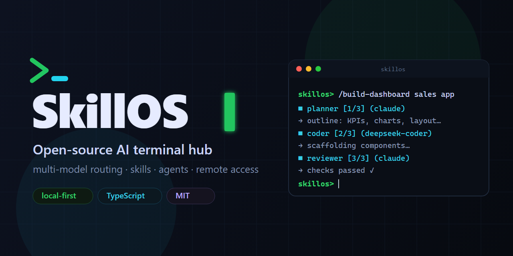

<div align="center">



# SkillOS

### The open-source AI terminal hub — intelligent multi-model routing, portable skills, agents, and remote access. Local-first. Hackable. Terminal-native.

[](https://github.com/Manjussha/skillos/actions/workflows/ci.yml)
[](LICENSE)
[](https://www.typescriptlang.org/)
[](https://nodejs.org/)
[](https://react.dev/)
[](CONTRIBUTING.md)
[](ROADMAP.md)

[](https://github.com/Manjussha/skillos/stargazers)
[](https://github.com/Manjussha/skillos/network/members)
[](https://github.com/Manjussha/skillos/issues)
[](https://github.com/Manjussha/skillos/commits/main)

**[Quick Start](#-quick-start) · [Features](#-features) · [How it works](#-how-it-works) · [Commands](#-commands) · [Roadmap](ROADMAP.md) · [Contributing](CONTRIBUTING.md)**

</div>

---

## What is SkillOS?

**SkillOS is a lightweight, open-source AI terminal operating system.** You type into a terminal; SkillOS parses the command, picks the right **skill**, routes it to the best **AI model** (Claude, GPT‑4o, Gemini, DeepSeek, Groq, or a local model via Ollama), and streams the response back — all from one hackable, Markdown-based, local-first hub.

It's a **self-hosted, terminal-native AI assistant** that unifies many models and tools behind one prompt. Think of it as a programmable command center for LLMs: a multi-model router, a portable skills ecosystem, lightweight AI agents, secure remote access, and bridges to other AI terminals — in a single TypeScript monorepo.

> **The differentiator isn't "supports many models."** It's **intelligent capability routing + portable skills + terminal interoperability.**

```
You → Terminal → Command Parser → Skill Engine → Model Router → Provider → streamed response
```

> ⚙️ **Status: v0.1, feature-complete and runnable.** Works **fully offline** out of the box via a built-in mock provider (no API key required to try it). Add an OpenRouter key or run Ollama for real model output.

---

## 🎬 Demo

<div align="center">

<br><sub>A SkillOS session: list skills, then run a multi-agent <code>/build-dashboard</code> workflow.</sub>
</div>

## ✨ Features

- 🧩 **Portable skills** — prompt/tool/agent skills as plain **Markdown or JSON** files. Drop a file in `skills/`, it's instantly available. No code change.
- 🔀 **Intelligent model routing** — rule-based routing maps each task to the best model; a `mode` (fast / best / cheapest / **local-private**) biases provider + model tier per request.
- 🌐 **Multi-provider** — OpenAI, **Claude (Anthropic)**, **Gemini**, **DeepSeek**, **Groq**, **OpenRouter** (one key, many models), and **Ollama** (local models) via the Vercel AI SDK — plus an offline **mock** provider.
- 🤖 **AI agents & workflows** — built-in **Planner → Coder → Reviewer → Writer**; chain them with `/build-dashboard`, `/build-api`. Real stage-to-stage context passing.
- 🪄 **Personalized onboarding** — first-run setup learns your use-case, stack, and mode; **auto-loads** relevant skills and can **auto-generate** new skills for your domain.
- 📡 **Remote access** — `/remote start` opens a **Cloudflare Tunnel** with a public URL + **QR code**, **scoped expiring session tokens**, and a permission gate that prompts before privileged tools run remotely.
- 🔗 **Terminal bridges** — wrap external AI terminals (**Aider**, local shell) as first-class SkillOS commands via a stable bridge interface.
- 💻 **Two clients, one protocol** — a **browser terminal** (xterm.js) and a **native CLI** that speak the same WebSocket protocol.
- 🪶 **Lightweight & hackable** — no Kubernetes, no LangChain, no Electron. Local-first, Markdown-based, easy to read and extend.

---

## 🚀 Quick Start

**Requirements:** Node.js ≥ 20.

```bash
# 1. clone & install (npm workspaces)
git clone https://github.com/Manjussha/skillos.git
cd skillos
npm install

# 2a. Browser terminal — server + web client
npm run dev
#     open the URL Vite prints (default http://localhost:5173)

# 2b. OR native terminal — run the server, then the CLI in another shell
npm run dev:server
npm run cli
```

On first run, onboarding walks you through **use-case → stack → mode → provider → (optional) API key**. Pick **Skip** at the provider step to try everything immediately with the offline mock provider — **no API key needed**.

Then try:

```bash
/help                                  # list everything
/skills                                # your skills (active ones marked *)
/seo a punchy title for a print shop   # routed + streamed response
/build-dashboard a sales overview      # watch Planner → Coder → Reviewer
/connect shell                         # then: /run shell echo hello
/remote start                          # public URL + QR (degrades gracefully)
```

**Want real models?** Pick a provider during onboarding — **OpenRouter** (one key, many models) or a direct provider (**OpenAI / Anthropic / Google / Groq / DeepSeek**) — and paste its key (saved to `.env`, applied instantly — no restart), or run [Ollama](https://ollama.com) locally for private, on-device AI. Switch providers any time at runtime with **`/provider`** (lists all providers, marks the active one and which already have a key) and pick a specific model with **`/models`**. The active provider is remembered via `SKILLOS_PROVIDER`.

---

## 🧱 How it works

```
                          ┌──────────────────────────────────────────┐
  Browser terminal ─┐     │                SkillOS server            │
  (xterm.js)        ├─ WS │  parser → skill engine → model router →   │ → Provider
  Native CLI ───────┘     │  ↳ agents · onboarding · permissions      │   (OpenRouter /
  Phone (via tunnel)      │  ↳ bridges · remote (tunnel/QR/tokens)    │    Ollama / mock)
                          └──────────────────────────────────────────┘
                                          ↕ SQLite (Prisma)
```

| Piece | Where |
| --- | --- |
| Browser terminal (React + xterm.js) | `apps/client` |
| Native terminal client (Node readline) | `apps/cli` |
| Gateway, parser, skill engine, router, providers, agents, remote, bridges | `apps/server` |
| Skill definitions (Markdown / JSON) | `skills/` |
| Persistence (SQLite + Prisma) | `storage/` |

Built in **runnable layers** (each works before the next) — see **[ROADMAP.md](ROADMAP.md)**.

---

## 🧩 Skills

A skill is a Markdown (YAML frontmatter) or JSON file under `skills/<category>/`:

```markdown
---
name: seo
description: SEO blog title and outline writer
category: marketing
bestModel: claude
tools: []
---

You are an SEO expert. Given the user's topic, produce a punchy, search-optimized
title, a one-line meta description, and a 5-point outline.
```

`category` drives routing. Add a file → it's loaded at server start, no code change. Or generate skills for your domain: `/generate-skills I run a printing business`.

## 🤖 Agents

| Agent | Role |
| --- | --- |
| `planner` | Break a task into a concrete plan |
| `coder` | Implement from the plan |
| `reviewer` | Review for bugs & quality |
| `writer` | Clear prose / docs / copy |

`/build-dashboard` and `/build-api` chain Planner → Coder → Reviewer, feeding each stage's output to the next.

---

## ⌨️ Commands

| Command | Description |
| --- | --- |
| `/help` | List all commands |
| `/skills` · `/models` | List skills / known models |
| `/use <model>` | Force a model (or `/use auto`) |
| `/onboarding` · `/profile` | (Re)run setup / show your profile |
| `/generate-skills <domain>` | Auto-generate skills for a described domain |
| `/agents` · `/agent <name> <task>` | List / run an agent |
| `/build-dashboard <d>` · `/build-api <d>` | Multi-agent workflows |
| `/remote start\|status\|stop` | Remote access (tunnel + token + QR) |
| `/connect <shell\|aider>` · `/bridges` | Connect / list terminal bridges |
| `/run <skill\|wrapped> …` | Run a skill or a bridge command |

---

## 🛠️ Tech Stack

**TypeScript** · **Node.js** · **React 19** · **Tailwind CSS 4** · **xterm.js** · **WebSockets** · **Vercel AI SDK** (multi-provider) · **Ollama** (local models) · **SQLite + Prisma** · **Cloudflare Tunnel** (remote) · npm workspaces monorepo.

> Note: the original design listed LiteLLM, but SkillOS uses the **Vercel AI SDK** to stay all-TypeScript — it covers OpenAI, Anthropic, Gemini, Groq, OpenRouter, and Ollama through one streaming interface.

---

## 🗺️ Roadmap & Vision

v0.1 ships the full loop end to end. Next up: a skills marketplace, learned (ML) routing, more terminal bridges, richer mobile control, and packaging. See **[ROADMAP.md](ROADMAP.md)** and the original product vision in **[POD.md](POD.md)**.

## 🤝 Contributing

Contributions welcome — the easiest first PR is **a new skill** (just a Markdown file!). See **[CONTRIBUTING.md](CONTRIBUTING.md)**.

## 📄 License

[MIT](LICENSE) © SkillOS contributors.

---

<div align="center">

**If SkillOS is useful to you, please ⭐ star the repo — it helps others discover it.**

<sub>Keywords: open-source AI terminal · multi-model LLM router · AI agents · AI skills · local-first AI · self-hosted ChatGPT alternative · Claude / GPT-4o / Gemini / DeepSeek / Groq / Ollama / OpenRouter · terminal AI assistant · Aider / Cursor / Continue.dev alternative · TypeScript · WebSocket streaming · Cloudflare Tunnel.</sub>

</div>
